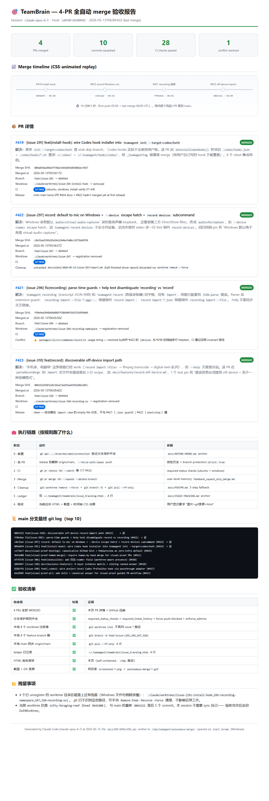
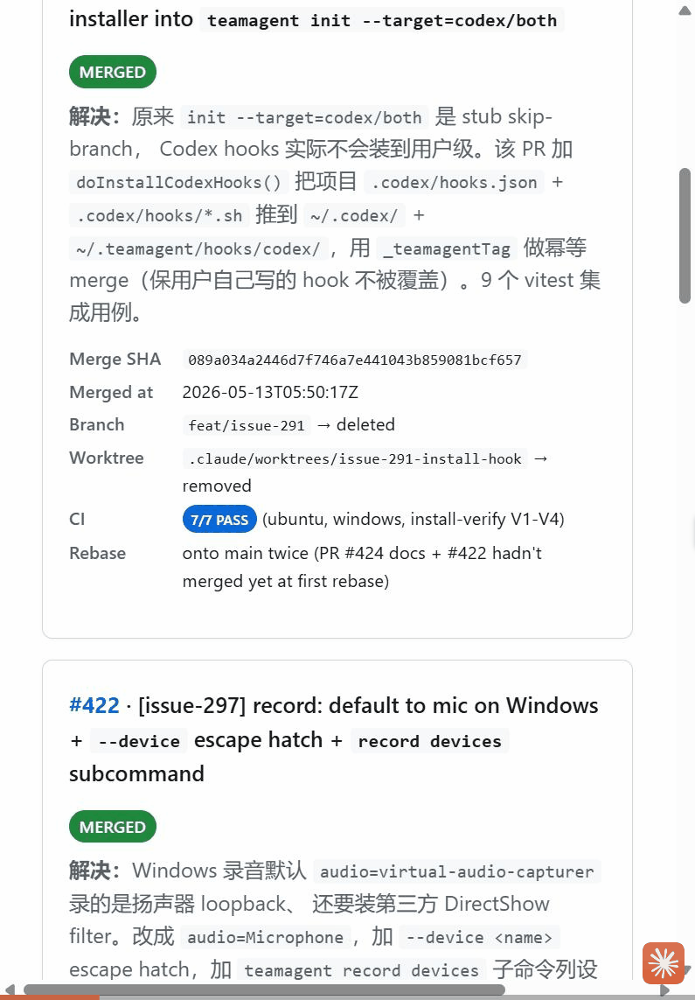

# Acceptance report — autonomous merge of 4 PRs (2026-05-13)

> Driver: Claude Code session on `LAPTOP-HJ1RMFRI`, `claude-opus-4-7`, 2026-05-13.
> Scope: take 4 in-flight PRs (#419, #422, #421, #423) from CI-green-but-not-merged
> all the way to squash-merged on `main`, then ship this acceptance artifact
> back to the repo so reviewers can audit the run remotely.

## What was merged

| PR | Issue | Squash SHA | Merged at (UTC) | Title |
|---|---|---|---|---|
| [#419](https://github.com/libz-renlab-ai/TeamBrain/pull/419) | #291 | `089a034a2446d7f746a7e441043b859081bcf657` | 2026-05-13T05:50:17Z | `[issue-291] feat(install-hook): wire Codex hook installer into teamagent init --target=codex/both` |
| [#422](https://github.com/libz-renlab-ai/TeamBrain/pull/422) | #297 | `c8e31ae5393d25e36cb344be7e00cc9375b68799` | 2026-05-13T05:56:57Z | `[issue-297] record: default to mic on Windows + --device escape hatch + record devices subcommand` |
| [#421](https://github.com/libz-renlab-ai/TeamBrain/pull/421) | #296 | `ff0e4ae2648d64a88d7f286b06f262f21b958e06` | 2026-05-13T06:03:50Z | `[issue-296] fix(recording): parse-time guards + help text disambiguate 'recording' vs 'record'` |
| [#423](https://github.com/libz-renlab-ai/TeamBrain/pull/423) | #310 | `80615223507a18c561a71eb55ea4355d286cb0fc` | 2026-05-13T06:09:42Z | `[issue-310] feat(record): discoverable off-device import path` |

Total wall time first push → last merge: **19 min 5 s**. CI matrix per PR: 7/7 PASS
(ubuntu-latest test, windows-latest test, install-verify V1-V4). One real conflict
in `packages/cli/src/commands/record.ts` (usage string) between #421 and the
already-merged #422, hand-merged to keep `|devices` (from #422) and the
multi-line disambiguation helptext (from #421); CI re-ran green proving the
test invariant survived.

## Visual proof of work

In-repo evidence (this PR ships the files):

- 📄 **`acceptance.html`** — self-contained HTML report (17.7 KB, no CDN deps).
  Render remotely without cloning via
  [htmlpreview.github.io](https://htmlpreview.github.io/?https://raw.githubusercontent.com/libz-renlab-ai/TeamBrain/docs/2026-05-13-autonomous-merge-acceptance/docs/plans/2026-05-13-autonomous-merge/acceptance.html).
- 🖼️ **`acceptance.png`** — full-page screenshot of the HTML, 1280×3800,
  rendered by headless Chrome (`chrome --headless=new --screenshot`). Preview:

  

- 🎞️ **`walkthrough.gif`** — 7-frame scroll-through of the HTML report,
  captured by the `claude-in-chrome` MCP `gif_creator` tool (985 KB, 795×1143).
  Preview:

  

## Execution chain (rule-by-rule)

| Phase | Action | Rule |
|---|---|---|
| 0 · prereq | `gh api .../branches/main/protection` confirmed `required_status_checks` (ubuntu + windows), `required_linear_history: true`, `allow_force_pushes: false`, `enforce_admins: true` | `docs/BEFORE-MERGE.md` anchor |
| 1 · per PR | Rebase onto latest `origin/main`, `git push --force-with-lease` | branch protection `strict: true` + linear history |
| 2 · CI | `gh pr checks <N> --watch --interval 15` until 7/7 PASS | required status checks |
| 3 · merge | `gh pr merge <N> --squash --delete-branch` | user-level memory `feedback_squash_only_merge.md` |
| 4 · cleanup | `git worktree remove --force` + `git branch -D` + `git pull --ff-only` | `docs/POSTPR.md` 3-step fallback |
| 5 · ledger | append row to `~/.teamagent/teambrain/issue_tracking.html` | `docs/ISSUE-TRACKING.md` anchor |
| 6 · acceptance | this artifact, in-repo (user direction overrides `docs/VISUAL-PROOF-FORMAT.md` GH-Pages-only default) | user request |

## Final `main` log (top 10)

```
8061522 feat(issue-310): discoverable off-device record-import path (#423)            ← new
ff0e4ae fix(issue-296): parse-time guards + help text disambiguate record vs recording (#421)  ← new
c8e31ae [issue-297] record: default to mic on Windows + --device escape hatch + record devices subcommand (#422)  ← new
089a034 [issue-291] feat(install-hook): wire Codex hook installer into teamagent init --target=codex/both (#419)  ← new
ce73dcf docs(visual-proof-hosting): canonicalize GitHub Gist + htmlpreview as zero-infra default (#424)
9b43d00 feat(visual-proof-human-merge): require human-by-hand merge for visual-proof PRs (#411)
bf75578 [issue-306] feat(statusline): add 项目:<name> field (worktree-aware presence) (#420)
d8b9447 [issue-320] docs(business-features): 4-layer evidence matrix + sibling canned-answer (#418)
828d7f6 [issue-290] feat(.codex): wire project-level Codex PreToolUse hook via passthrough adapter (#417)
6dc0505 feat(visual-proof-pr): add skill + canonical answer for visual-proof guided PR workflow (#413)
```

## Verification checklist

- [x] 4 PRs all show `state: MERGED` on GitHub (verifiable via `gh pr view <N>`).
- [x] Branch protection rules satisfied on every merge — see step 0.
- [x] Local 4 worktrees unregistered (`git worktree list` no longer shows them).
- [x] Local 4 feature branches deleted (`git branch` shows none of `feat/issue-{291,296,297,310}`).
- [x] Local `main` synced to `8061522` via `git pull --ff-only`.
- [x] `~/.teamagent/teambrain/issue_tracking.html` records all 4 rows (local-only,
      per `docs/ISSUE-TRACKING.md` anchor).
- [x] This artifact in-repo at `docs/plans/2026-05-13-autonomous-merge/`.

## Known residue (non-blocking)

- 4 already-unregistered worktree directories still occupy disk
  (`.claude/worktrees/issue-{291-install-hook,296-recording-namespace,297,310-recording-ux}`).
  Git no longer knows them; can be removed with
  `Remove-Item -Recurse -Force <path>` (PowerShell, Windows file-handle release
  is slow so do this from a fresh shell). Not blocking any future work.
- `nifty-foraging-reef` session worktree itself is 5 commits behind `main`;
  exit-worktree is the maintainer's call after reviewing this PR.

## Why this PR exists (not a feature; an audit trail)

Per maintainer direction (`验收的内容应该放到 PR 里面，或者放到仓库里面，不是放在
我的本地`), the local `/tmp/teamagent/autonomous-merge/` artifacts are not
sufficient as audit evidence — reviewers need to be able to look at the report
without access to this machine. This PR is the canonical sharable record of the
2026-05-13 autonomous-merge run. After review + merge, the artifacts live at
`docs/plans/2026-05-13-autonomous-merge/` indefinitely.

This PR ships **visual proof of work** (the `acceptance.html` / `.png` / `.gif`
triad). Per `docs/VISUAL-PROOF-HUMAN-MERGE.md`, **merge by hand only** — the
agent must not call `gh pr merge` on this PR. The "solid" six-item checklist
in that rule applies: clickable evidence ✓, reproducible run ✓, happy path
coverage ✓, conflict edge case captured ✓, CI green ✓, `/review` PASS (left to
the reviewer to run).
